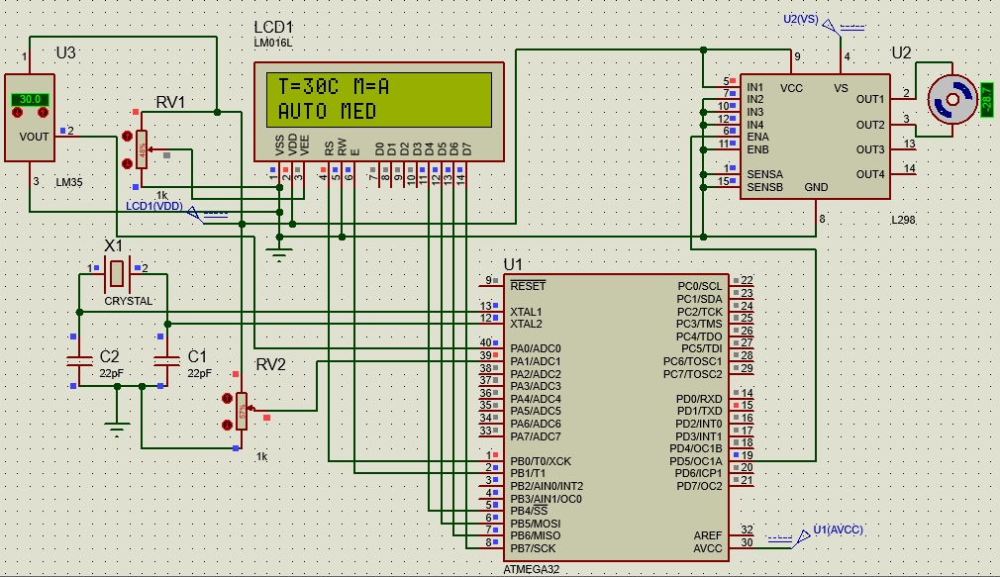

# 🌬️ Smart Fan Controller

A smart fan control system based only on temperature measurement using an AVR microcontroller (ATmega32).  
The system reads temperature values and automatically controls a DC motor (fan) while displaying the data on an LCD screen. It also supports wireless communication using Bluetooth (HC-05).

---

## 🛠️ Components Used

- **Microcontroller:** ATmega32  
- **Sensor:** DHT11 (Temperature only)  
- **Display:** I2C LCD 16x2  
- **Motor:** DC Motor  
- **Motor Driver:** L298 or MOSFET  
- **Bluetooth Module:** HC-05  
- **Power Supply:** 5V / 12V  

---

## ⚙️ Project Idea

The system works as follows:
- Reads temperature from the DHT11 sensor  
- Controls the DC motor (fan) based on temperature level  
- Displays real-time temperature on LCD  
- Sends/receives data via Bluetooth (HC-05) for wireless monitoring or control  
- Provides an embedded smart control system  

---

## 📂 Project Files

- `main.c` → Main program code  
- `DHT11.c / DHT11.h` → Temperature sensor driver  
- `i2c_lcd.c / i2c_lcd.h` → LCD driver using I2C  
- `Bluetooth (HC-05)` → Wireless communication module integration  
- `Micro project fan.pdsprj` → Proteus simulation file  
- `Alaa project fan.hex` → Compiled firmware file  

---

## 📸 Project Images

### 🔌 Proteus Simulation

### 📟 LCD Output

---

## 🎥 Video Demonstration

https://youtube.com/your-video-link

---

## 🚀 Features

- Automatic DC motor control based on temperature  
- Real-time temperature monitoring  
- LCD display interface  
- Wireless control via HC-05 Bluetooth  
- Embedded AVR system design  

---

## 👨‍💻 Author

Alaa
